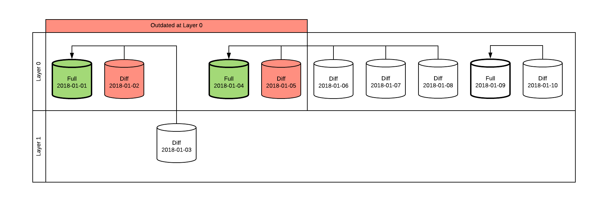
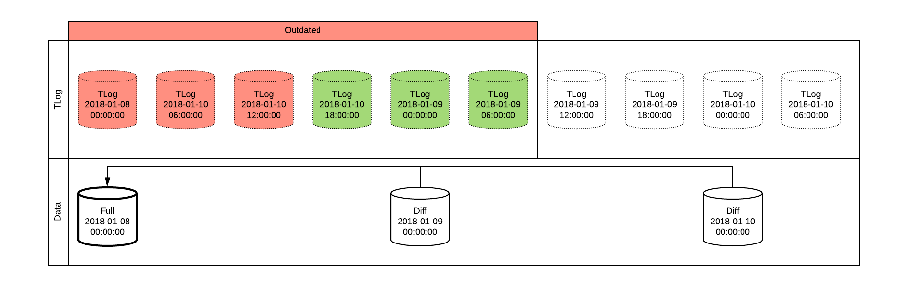

# MSSQL Backup/Restore 3
## Структура файлов и папок
Подпапки:
- `qeue` - очередь бекапов/ресторов
    - `new` - бекапы, ждущие очереди
    - `act` - активные бекапы
    - `fin` - завершенные бекапы
    - `err` - бекапы которые были завершены с ошибкой
    - `wrn` - бекапы которые были завершены, но с не критическими ошибками
- `data` - бекапы данных (full/diff/...)
- `tlog` - бекапы логов транзакций
    - `<fs-sqlsrv-name>`  папка с бекапами определённого экземпляра SQL
        - `<fs-sqldb-name>` папка с бекапами определённой БД

Файлы:
- `qeue\.\<bkp-queue-priority>.<fs-datetime-n>.<fs-sqlsrv-name>.<fs-qitem-id>.json` - элемент очереди бекапов/ресторов
- `data\<fs-sqlsrv-name>\<fs-sqldb-name>`
    - `\<fs-db-data-bkp>.bak` - бекап данных `<fs-datetime-n>.db-<bkp-type>.<arc-layer>.<bkp-device-seqcode>.bak`
    - `\<fs-db-datapart-bkp>.bak` - бекап файла или файловойгруппы `\<fs-datetime-n>.<dataobj-type>-<bkp-type>.<fs-dbfile-or-dbfgroup>.<arc-layer>.<bkp-device-seqcode>.bak`
- `tlog\<fs-sqlsrv-name>\<fs-sqldb-name>`
    - `\<fs-db-tlog-bkp>.trn` - бекап лога трензакций `\<fs-datetime-n>.<fs-dblsn-last>.<bkp-device-seqcode>.trn`

## Настройки
Настроечный файл может быть XML и JSON.
- `OV-MSSQLBkp` : **`обяз`** - корневой элемент группы настроек бекапа MS SQL. [_xml_]=`/OV-MSSQLBkp`; [_json_]=`$.OV-MSSQLBkp`.
    - `SV-Inherits` : **`!обяз`**, `[URI]` - путь к файлу с default настройками, т.е. файлу который наследуется.
    - `SL-Repo` : **`обяз`**, **`спис`**, `[URI]` - корневая папка бекапов - репозиторий.
    - `SV-SrvInst` : **`!обяз`** - имя экземпляра MS SQL. Если не указано, то берётся из названия папки в которой лежит файл настроек. В названии  папки `$` заменяется на `\` чтоб получить адрес именованного экземпляра.
    - `SV-DBName` : **`!обяз`** - имя бд экземпляра MS SQL. Если не указано, и то берётся из названия файла настроек. В названии выделяется имя до первой точки `.` и раскодируется алгоритмом Uri-unescape.
    - `OV-DataBkpRule` : **`?обяз`** - Группа настроек бекапа данных.
        - `SV-OperAllow` : **`!обяз`** - типы допустимых бекапов (по-умолчанию любые типы):
            - "`f`" - только полные бекапы, 
            - "`d`" - только расностные бекапы.
        - `SV-DiffFullRatioMax` : **`обяз`**- отношение размера разностного бекапа к размеру полного, при котором нельзя делать разностный бекап. Если `SV-OperAllow` равен `f`  будет делаться полный бекап.
        - `SV-DiffSizeFactor` : **`обяз`** - коефициент умножения размера разностного бекапа при рассчёте `SV-TotalSizeMax`.
        - `SV-TotalSizeMax` : **`обяз`** - максимальный совокупный размер бекапа. Совокупный размер считается по формуле `(размер_Full) + (размер_Diff) * ${SV-DiffSizeFactor}`. Если `SV-OperAllow` равен "`f`" то будет делаться полный бекап.
        - `SV-ArchLayer` : **`!обяз`** - номер архивного слоя.
        - `SV-Compression` : **`!обяз`** - включить сжатие бекапов.
        - `SV-Begin` : **`обяз`** - время начала бекапа - "левая граница" окна.
        - `SV-Duration` : **`обяз`** - время за которое бекап нужно сделать - "ширина" окна.
    - `OV-TLogBkpRule` **`?обяз`** - настройки времени бекапа лога транзакций.
        - `SV-AgeTrg` **`обяз`** - частота снятия бекапов: время прошедшее с последнего бекапа, после которого надо сделать бекап. Если не указано, то бекап делается по времени `SV-AgeTrg`.
        - `SV-TLogUsageMaxTrg` **`!обяз`** - объём использованного в логе транзакций места при котором надо сделать бекап. Если не указано, то бекап делается по времени `SV-AgeTrg`.
        - `SV-TLogUsageMinTrg` **`!обяз`** - если время с последнего бекапа лога транзакций уже превысило `SV-AgeTrg`, но объём  использованного в логе транзакций места меньше `SV-TLogUsageMinTrg` при котором надо сделать бекап. Если не указано, то бекап делается по времени `SV-AgeTrg`.
        - `SV-ChkPeriod` **`!обяз`** - частота проверки состояния лога.
        - `SV-Compression` : **`!обяз`** - включить сжатие бекапов.
        - `SV-Begin` : **`обяз`** - время начала бекапа - "левая граница" окна.
        - `SV-Duration` : **`обяз`** - время в течение которого нужно делать бекапы - "ширина" окна.
    - `OV-LangolierRule` : **`?обяз`** - настройки процесса очистки старых бекапов.
        - `SL-DataRtn` : **`обяз`**, **`спис`**, `[TimeSpan]` - время хранения бекапов данных (full/diff/..).
            - `SV-Layer` : **`!обяз`** - номер слоя. По-умолчанию номером слоя будет абсолютная позиция в коллекции `SL-DataRtn`.
        - `SV-KeepCopyOnly` : **`!обяз`**, `[Boolean]` - Если НЕ указано, то все copy-only бекапы данных (`data`), кроме самого последнего, удаляются в процессе очистки; иначе copy-only бекапы найденные в папке будут удаляться, по тем же условиям, что и не copy-only. К `tlog` copy-only бекапам это не относится.
        - `SV-TlogRtn` : **`!обяз`**, `[TimeSpan]` - время хранения бекапов лога транзакций. Сopy-only бекапы `tlog` удаляются все, кроме самого последнего из всех `tlog` бекапов.

## Очередь бекапов/ресторов
Каждый скрипт бекапа/рестора создаёт файл в папке `queue\new`. Файл содержит в себе информацию о выполняемом бекапе/ресторе.
После того как менеджер очереди перенесёт файл в папку `queue\act` бекап фактически начинается. Раз в минуту, процесс бекапа/рестора обновляет свой файл в очереди, записывая новое значение heartbit. Если бекап/рестор завершился успешно, то он переносит свой файл очереди в папку `queue\fin`, а при ошибке в папку `queue\err`; так же существует папка `queue\wrn` в которую переносятся файлы для которых бекап выполнился успешно, но система обнаружила НЕ критические ошибки в процессе. Менеджер очереди проверяет файлы в `queue\act` и все файлы, которые не обновлялись больше 5 минут, переносит в папку `queue\err`. Файлы в папках `queue\fin`, `queue\err`, `queue\wrn` удаляются менеджером очереди в соответсвии с его настройками.

Для процесса бекапа БД, файл содержит следующие данные:
- `O-MSSQLBkpQ` - корневой элемент.
    - `V-HeartBit` - значение heart-bit. Обновляется периодически процессом бекапа, фактически это результат Win32::GetTickCount.
    - `V-Host` - имя сервера, на котором запущен скрипт бекапа.
    - `V-HostProcId` - ProcessId скрипта бекапа.
    - `V-JobType` - тип задания на бекап (DbFull/DbDiff/...)
    - `V-SrvInst` - имя сервра БД которую бекапят.
    - `V-DBName` - имя БД.
    - `V-ConfPath` - путь к файлу конфигурации, который использует скрипт бекапа.

## Именование папок и файлов объектов
~~~ EBNF
dhexnum-char = ? цифра/буква 32-хичного числа "0123456789ABCDEFGHJKMNPRSTUVWXYZ" ? ;
hexnum-char  = ? цифра/буква шетснадцатиричного числа [a-fA-F0-9] ? ;
num-char     = ? цифра [0-9] ? ;
latin1-char  = ? буква латинского алфавита [a-zA-Z] ? ;

fs-db-data-bkp     = fs-datetime-n , "." , "db-"              , bkp-type , "." , arc-layer [ , "." , bkp-device-seqcode ] , " .bak" ;
fs-db-datapart-bkp = fs-datetime-n , "." , dataobj-type , "-" , bkp-type , "." , fs-dbfile-or-dbfgroup , "." , arc-layer [ , "." , bkp-device-seqcode ] , ".bak" ;
fs-db-tlog-bkp     = fs-datetime-n , "." , fs-dblsn-last [ , "." , bkp-device-seqcode ] , ".trn" ;

fs-bkp-queue-item  = queue-item-type , "." , queue-priority , "." , fs-datetime-n , "." , fs-sqlsrv-name , fs-queue-item-id , ".json" ;

fs-uriesc-name     = { complement-sqlname-char | fs-uriesc-char } ;
complement-sqlname-char = ? любой символ, допустимый в имени sql-объекта, кроме запрещенных в именах файлов, точки и uri-escape символа ? ;
fs-uriesc-char     = "%", hexnum-char * 2 ;

fs-datetime-n      = fs-datetime | "________-______" | "~~~~~~~~-~~~~~" ;
fs-datetime        = ? дата+время в формате: "yyyyMMdd-HHmmss" ? ; 

fs-sqlsrv-name     = server-name , [ "$", sqlinst-name ] ;

fs-sqldb-name      = fs-uriesc-name ;

queue-priority     = 2 * ( num-char ) ;

queue-item-type    = "b" | "r" ;

fs-queue-item-id   = dblhexnum-char { , dblhexnum-char } ;

dataobj-type       = "fl" | "fg" ;

bkp-type           = "d" | "f" ;

arc-layer          = 2 * ( num-char | "_" ) ;

fs-dblsn-last      = 17 * ( dblhexnum-char | "~" ) ;

bkp-device-seqcode = latin1-char ;

~~~

`<fs-uriesc-name>` - имя состоящее из любых допустимых в именах файлов символов. Недопустимые символы `? * \ / : | > < ` и `. %` экранируются по алгоритму Uri .

`<fs-sqlsrv-name>` - имя сервера ms sql. Для именованых экземпляров символ `\` заменяется на `$`. Экранирования не делается, т.к. именование серверов и sql-экземпляров имеет те же ограничения что именивание файлов.

`<fs-sqldb-name>` - имя бд ms sql.

`<fs-datetime-n>` - временная метка в формате: `yyyyMMdd-hhmmss`, где допускается `?null?` значение.

`<dataobj-type>` - код типа sql объекта. Код `db` на этой позиции - бекап бд 
- `fl` - бекап файла
- `fg` - бекап файловой группы

`<bkp-type>` - код типа sql бекапа.
- `f` - полный бекап (**F**ull  backup)
- `d` - разностный бекап (**D**ifferential backup)

`<fs-dblsn-last>` - LSN номер транзакции. Закодированный в 32-х разрядное число из букв и цифр.

`<arc-layer>` - номер слоя архива, нужен в процессе удаления старых бекапов.

`<bkp-device-seqcode>` - при одновременном копировании в несколько файлов код файла с "a" до "z"

Для `COPY_ONLY` бекапов данных `<arc-layer>` указывается `"_"` (`<null>` значение).

Для `COPY_ONLY` бекапов логов `<fs-dblsn-last>` указывается `"~"` (`<null>` значение).

### Примеры
`data\sqlmon-01\dba_db\20180907-120000.db-f.00.bak` бекап бд `[sqlmon-01].[dba_db]` от "7 сен 2018 12:00:00", полный

`data\sqlmon-01\dba_db\20180219-153000.db-f.__.bak` - бекап бд `[sqlmon-01].[dba_db]` от "19 фев 2018 15:30:00", полный `COPY_ONLY`

`data\sqlcrm-01$inst0\1c\20180101-030000.db-d.01.a.bak`, `data\sqlcrm-01$inst0\1c\20180101-030000.db-d.01.b.bak` - бекап бд `[sqlcrm-01\inst0].[1c]` от "1 янв 2018 03:00:00", разностный, уровень архивирования 1, в два файла `a` и `b`.

## Удаление старых файлов
### Бекапы данных
Каждый бекап данных имеет атрибут "номер слоя", который влияет на последующий процесс удаления. Время хранения бекапов указывается для каждого слоя. Менеджер очистки удаляет все бекапы чей возраст больше указанного времени, и только те у которых "номер слоя" меньше или равен указанному в настройках менеджера. Также учитывается связь между полными и разностными бекапами: удаляются только те полные бекапы, у которых все связанные с ними разнострые бекапы должны быть удалены.

### Пример
Принцып работы менеджера очистки хорошо виден на примере. На указанной ниже диаграме менеджер настроен удалять все бекапы сделанные раньше 5 января включительно, однако на слое 1 время хранения не указано. Бекап от 3 января был сделан (например) перед выполнением сложного пересчёта данных и его нельзя удалять до особого указания. Однако, бекап от 3 января является разностным, и для восстановления понадобится последний полный бекап данных - который был сделан 1 января - система это учитывает и удалять бекап от 4 января так же не будет. Аналогично не будет удалён бекап от 4 января, т.к. он необходим для восстновления из бекапа от 6 января.

### Бекапы файлов логов транзакций
Бекапы лога транзакций не имеют "слоёв". Удаление производится следующим образом: находится самый свежий бекап данных, чей возраст больше указанного максимального возраста бекапа лога транзакций; если таковых нет, то берётся самый старый бекап данных. Затем удаляются все бекапы лога транзакций, старше найденного бекапа данных, за исключением первого (самого свежего).

### Пример
Пример работы менеджера очистки показан на диаграме ниже. В данном прмере менеджер настроен удалять бекапы логов транзакций, которые были сделаны ранее 12:00 10 января. Последний бекап данных был выполнен в полночь 9 января, поэтому бекапы лога транзакций начиная с того который был сделан перед бекапом данных, будут сохранены.

